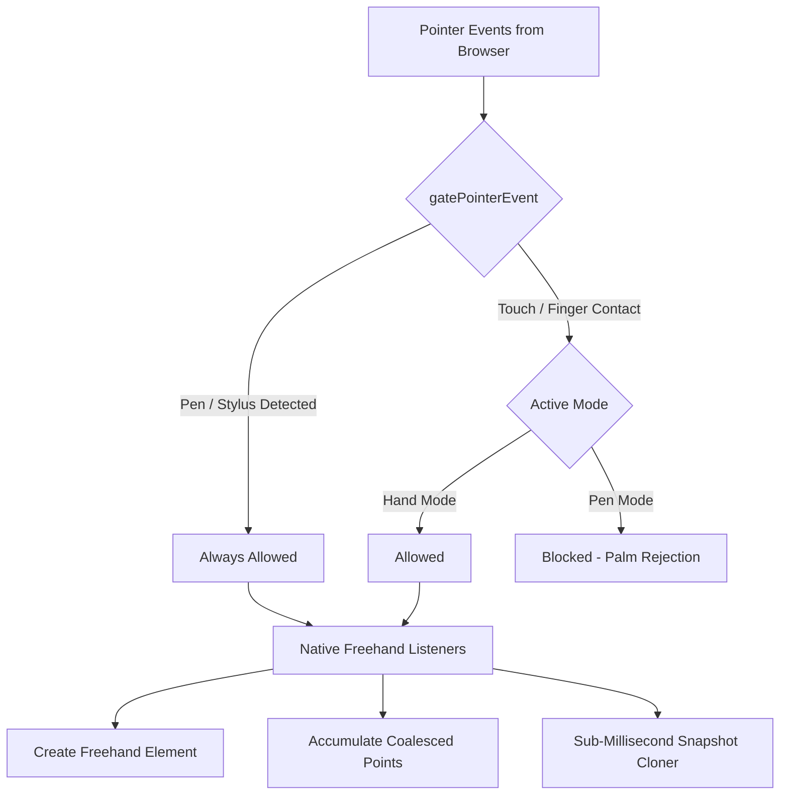

# Whiteboard Stylus & Pen Architecture Documentation

This document describes the high-performance stylus, pen, and touch architecture implemented in this application. The design mimics and enhances Excalidraw-style responsiveness, ensuring compatibility with a wide range of devices (Apple Pencil, Samsung S-Pen, active/passive styluses, Windows Ink) and lag-free, high-frequency writing.

---

## 1. Core Architectural Pillars



### I. Universal Input Gating & Multi-Stylus Recognition
- **Files**: [`src/lib/input/pen-detect.ts`](file:///c:/work/Drawer/Board/src/lib/input/pen-detect.ts) (detection), [`src/lib/input/input-gate.ts`](file:///c:/work/Drawer/Board/src/lib/input/input-gate.ts) (policy)
- **Problem**: Styluses fall into two groups. *Digitizer pens* (Apple Pencil, S-Pen, Windows Ink/MPP, Wacom) are reported by the browser, though not always as `pointerType: 'pen'`. *Passive/capacitive styluses* are electrically a fingertip and are *indistinguishable from a finger at the event level* — no heuristic can find them.
- **Detection** (`isPenPointer`, the single source of truth — this logic used to be copy-pasted in three files that had drifted apart):
  - **Direct Pointer Type**: `e.pointerType === 'pen'`.
  - **Digitizer-only fields**: non-zero `tiltX`/`tiltY`/`twist`/`tangentialPressure`. No finger reports any of these, so this catches S-Pens delivered as `'touch'`.
  - **Vendor Strings**: `touchType` containing `"stylus"` or `"pen"`.
  - **Pressure is deliberately NOT used.** Chrome on Android reports analog pressure for *finger* contacts, so the old `pressure !== 0.5 && pressure !== 1` test classified fingers as pens and silently broke both palm rejection and two-finger pan.
- **Policy**: blocking every touch in Pen Mode is only correct once a real digitizer pen is known to exist. Doing it unconditionally is what made capacitive styluses — and tablets with no digitizer at all — unable to draw. So Pen Mode has two states:
  | Mode | Digitizer Pen | Finger / Capacitive Stylus | Mouse |
  | :--- | :--- | :--- | :--- |
  | **Pen Mode**, no digitizer seen yet | n/a | **Allowed** — primary contact only, palm-sized contacts rejected | **Allowed** |
  | **Pen Mode**, digitizer seen | **Allowed** | **Blocked** (palm rejection) | **Allowed** |
  | **Hand Mode** | **Allowed** | **Allowed** | **Allowed** |
- Secondary contacts (`!e.isPrimary`) are never strokes — they are pinch/pan. A second contact arriving mid-stroke discards the stroke and hands the gesture over.

---

### II. Dynamic Palm Rejection Engine
- **File**: [`src/lib/input/palm-rejection.ts`](file:///c:/work/Drawer/Board/src/lib/input/palm-rejection.ts)
- **Priority Window**: When drawing, users naturally rest their palm on the screen. The system monitors the time a pen lifts and blocks finger touch events for `PEN_PRIORITY_WINDOW_MS = 250`. This was 500ms, which is longer than a lift-and-write cycle when writing quickly, so it swallowed the *next* stroke.
- **Contact size**: `PALM_CONTACT_PX = 45` — the only signal available to separate a writing tip from a resting palm when no digitizer is present.

---

### III. Conflict Resolution & Performance (Native vs. React Events)
- **File**: [`src/components/canvas/Canvas.tsx`](file:///c:/work/Drawer/Board/src/components/canvas/Canvas.tsx)
- **Problem**: React's synthetic event handler processes events inside a rendering cycle and doesn't support coalesced pointer streams (necessary for high-resolution 240Hz pen polling). Registering a native drawing listener while React's `onPointerDown` handles selecting/dragging caused duplicate `setPointerCapture` calls, event drops, and canvas state lock-ups.
- **Solution**:
  - **React Listener Early Returns**: When the active tool is `'freehand'` (drawing mode), React's synthetic handlers (`handlePointerDown`, `handlePointerMove`, `handlePointerUp`) exit immediately. All drawing events are processed by lightweight native DOM listeners.
  - **Pointer Capture Clean-up**: Pointer IDs are cleaned up from the `rejectedPointers` set in React's pointer-up listener *before* early returning on blocked events, resolving stuck selection boxes and frozen panning states.

---

### IV. Browser Gesture Prevention & Double-Click Latency Fix
- **Problem**: Moving the pen up and down rapidly to write letters or words causes the browser to detect swipe-to-scroll, zoom gestures, or synthetic click/double-click events, interrupting the pointer stream and causing a 1-second delay.
- **Solution**:
  - **Unconditional Prevent Default**: The native drawing handlers call `e.preventDefault()` on `pointerdown` and `pointermove`. This blocks the mobile OS from reclaiming touch for page gestures.
  - **Release Prevention**: Calling `e.preventDefault()` on `pointerup` and `pointercancel` during drawing disables the browser from firing synthetic `click` and `dblclick` events, preventing thread-blocking reflows.
  - **Double Click Prevention**: `e.preventDefault()` on the React `onDoubleClick` event safeguards against double-tap-to-zoom actions.

---

### V. Auto-Switching Tool Heuristics
- When in `'select'` or `'hand'` (navigation/selection) mode, if a pen touches the canvas, the application automatically switches the active tool to `ShapeType.FREEHAND` and begins drawing immediately. This matches Excalidraw's seamless stylus experience. Special tools like the `'eraser'`, `'connector'`, or shape builders remain selected so you can use them with the pen.

---

## 2. Live Stroke Layer (the fix for dropped pen-downs when writing fast)

- **Files**: [`src/components/canvas/Canvas.tsx`](file:///c:/work/Drawer/Board/src/components/canvas/Canvas.tsx), [`src/lib/canvas/renderer.ts`](file:///c:/work/Drawer/Board/src/lib/canvas/renderer.ts)

### The problem
The in-progress stroke used to be committed to the Zustand store on **every `pointermove`**. Each move therefore:
1. rebuilt the element record and recomputed its bbox,
2. re-rendered every store subscriber (including `AdvancedToolbar`, which subscribes without a selector),
3. re-ran the render `useEffect` — whose dependency list contains `elements` — which synchronously repainted **the entire board**, re-tesselating every freehand stroke through `perfect-freehand`, and
4. allocated a fresh `rough.canvas`, `RoughRenderer`, `ImageHandler` and `ConnectorManager` per frame.

Cost per pointermove was therefore **O(all points on the board)**. On a page of handwriting this saturates the main thread, and the browser then delivers the next `pointerdown` late or drops the pointer stream entirely — which is exactly the "I lift the pen and write fast and it misses the stroke" symptom. `addElement` also took a full history snapshot *on pointerdown*, stalling the thread at the precise moment the first points were arriving.

### The fix
- **Two layers.** A second `<canvas>` sits above the board with `pointer-events: none`. While the pen is down, only that overlay repaints, drawing only the current stroke — **O(current stroke)**, not O(board).
- **The store is untouched during a stroke.** The element lives in a ref and reaches the store exactly once, on pen-up. Zero React renders between pen-down and pen-up.
- **One undo step per stroke.** Previously `addElement` (down) *and* `saveSnapshot` (up) each pushed history, so undo needed two presses per stroke and the intermediate state was a one-point stroke.
- **Hand-off, not blink.** The overlay is cleared only after the main canvas has painted the committed element (`overlayHandoffRef`), so there is no one-frame gap.
- **Same renderer both sides.** The overlay calls `renderFreehand`, so the live stroke and the committed stroke are pixel-identical — nothing shifts on commit.
- **Viewport culling** in `renderCanvas`, and per-canvas caching of the four render helpers that were being reallocated 240×/second.

---

## 3. High-Performance Snapshot System

- **File**: [`src/store/canvas-store.ts`](file:///c:/work/Drawer/Board/src/store/canvas-store.ts)

### The Serialisation Bottleneck
Previously, every finished stroke saved a history snapshot by serializing and parsing the entire canvas using:
```typescript
JSON.parse(JSON.stringify(elements))
```
If a user draws a complex freehand stroke with thousands of coordinates, this operation takes **100ms - 1000ms**, freezing the main thread and dropping the pointer events of the next pen touch.

### Structured Clone Optimization
We replaced JSON serialization with a custom manual structured cloner:
```typescript
const cloneElements = (elements: Record<string, WhiteboardElement>): Record<string, WhiteboardElement> => {
  const clone: Record<string, WhiteboardElement> = {};
  for (const id in elements) {
    if (Object.prototype.hasOwnProperty.call(elements, id)) {
      const el = elements[id]!;
      
      let points: [number, number, number?][] | undefined;
      if (el.type === ShapeType.FREEHAND) {
        points = [...(el as FreehandElement).points];
      }
      
      let controlPoints: { x: number; y: number }[] | undefined;
      if (el.type === ShapeType.CONNECTOR) {
        const conn = el as ConnectorElement;
        if (conn.controlPoints) {
          controlPoints = conn.controlPoints.map((cp) => ({ ...cp }));
        }
      }

      clone[id] = {
        ...el,
        style: el.style ? { ...el.style } : el.style,
        ...(points ? { points } : {}),
        ...(controlPoints ? { controlPoints } : {}),
        bbox: el.bbox ? { ...el.bbox } : undefined,
      } as WhiteboardElement;
    }
  }
  return clone;
};
```
This reduces the cloning operation to **< 1ms**, ensuring that the main thread is never blocked and fast pen strokes are captured instantly.

### Shared point arrays
`cloneElements` used to copy every freehand `points` array (`points = [...el.points]`), so a snapshot still cost **O(all points on the board)** — and one is taken per stroke, up to 100 deep. Point arrays are never mutated in place (`updateElement` always assigns a fresh array), so snapshots now **share the reference** and cost O(number of elements) instead. Undo/redo behaviour is unchanged.
