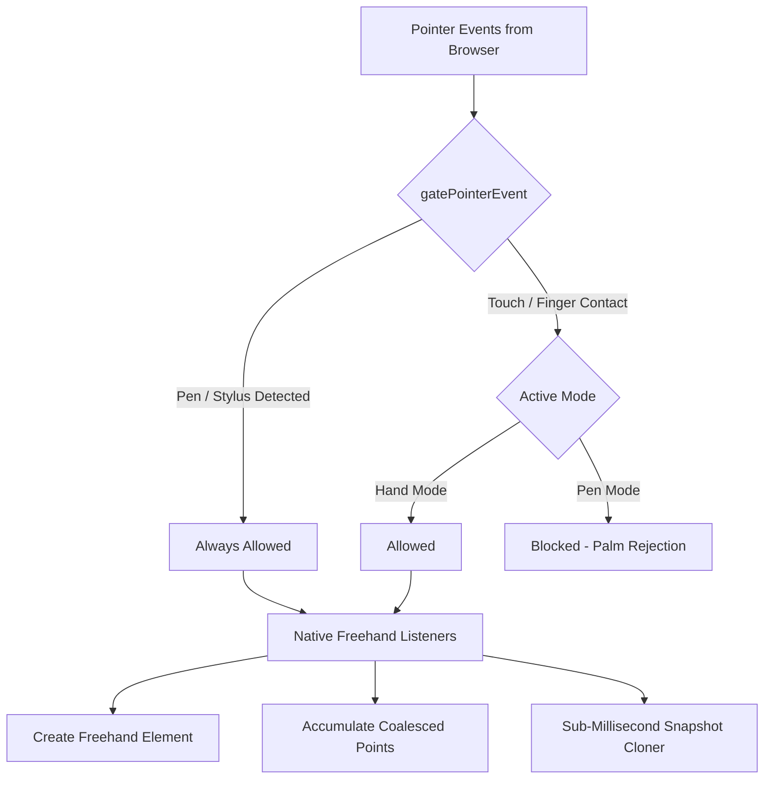

# Whiteboard Stylus & Pen Architecture Documentation

This document describes the high-performance stylus, pen, and touch architecture implemented in this application. The design mimics and enhances Excalidraw-style responsiveness, ensuring compatibility with a wide range of devices (Apple Pencil, Samsung S-Pen, active/passive styluses, Windows Ink) and lag-free, high-frequency writing.

---

## 1. Core Architectural Pillars



### I. Universal Input Gating & Multi-Stylus Recognition
- **File**: [`src/lib/input/input-gate.ts`](file:///c:/work/Drawer/Board/src/lib/input/input-gate.ts)
- **Problem**: Styluses on some platforms (like Samsung S-Pen or generic touch-emulating styluses) report as a generic `'touch'` pointer type in PointerEvents, which would be blocked by palm rejection in Pen Mode.
- **Solution**: Evaluates multiple pointer characteristics to dynamically detect if a pointer is a pen, even if labeled as `'touch'`:
  - **Direct Pointer Type**: `e.pointerType === 'pen'`
  - **Tilt Detection**: `tiltX` or `tiltY` has a non-zero value.
  - **Analog Pressure**: Active styluses report continuously varying analog pressures (values other than `0`, `0.5`, or `1.0`).
  - **Vendor Strings**: Checked against vendor-specific event fields (e.g., `touchType` or `pointerType` containing `"stylus"`, `"s-pen"`, or `"pen"`).
- **Behavior Matrix**:
  | Mode | Stylus Input (Pen) | Finger Input (Skin Touch) | Mouse Input |
  | :--- | :--- | :--- | :--- |
  | **Pen Mode** | **Allowed** (Draws) | **Blocked** (Palm Rejection) | **Allowed** (Selects/Draws) |
  | **Hand Mode** | **Allowed** (Draws) | **Allowed** (Draws/Interacts) | **Allowed** (Selects/Draws) |

---

### II. Dynamic Palm Rejection Engine
- **File**: [`src/lib/input/palm-rejection.ts`](file:///c:/work/Drawer/Board/src/lib/input/palm-rejection.ts)
- **Priority Window**: When drawing, users naturally rest their palm on the screen. The system monitors the time a pen lifts and blocks any finger touch events for a priority window of `500ms` (`PEN_PRIORITY_WINDOW_MS = 500`). This ensures that shifting hands or finger taps immediately following a pen stroke do not place accidental dots or lines.

---

### III. Conflict Resolution & Performance (Native vs. React Events)
- **File**: [`src/components/canvas/Canvas.tsx`](file:///c:/work/Drawer/Board/src/components/canvas/Canvas.tsx)
- **Problem**: React's synthetic event handler processes events inside a rendering cycle and doesn't support coalesced pointer streams (necessary for high-resolution 240Hz pen polling). Registering a native drawing listener while React's `onPointerDown` handles selecting/dragging caused duplicate `setPointerCapture` calls, event drops, and canvas state lock-ups.
- **Solution**:
  - **React Listener Early Returns**: When the active tool is `'freehand'` (drawing mode), React's synthetic handlers (`handlePointerDown`, `handlePointerMove`, `handlePointerUp`) exit immediately. All drawing events are processed by lightweight native DOM listeners.
  - **Pointer Capture Clean-up**: Pointer IDs are cleaned up from the `rejectedPointers` set in React's pointer-up listener *before* early returning on blocked events, resolving stuck selection boxes and frozen panning states.

---

### IV. Browser Gesture Prevention & Double-Click Latency Fix
- **Problem**: Moving the pen up and down rapidly to write letters or words causes the browser to detect swipe-to-scroll, zoom gestures, or synthetic click/double-click events, interrupting the pointer stream and causing a 1-second delay.
- **Solution**:
  - **Unconditional Prevent Default**: The native drawing handlers call `e.preventDefault()` on `pointerdown` and `pointermove`. This blocks the mobile OS from reclaiming touch for page gestures.
  - **Release Prevention**: Calling `e.preventDefault()` on `pointerup` and `pointercancel` during drawing disables the browser from firing synthetic `click` and `dblclick` events, preventing thread-blocking reflows.
  - **Double Click Prevention**: `e.preventDefault()` on the React `onDoubleClick` event safeguards against double-tap-to-zoom actions.

---

### V. Auto-Switching Tool Heuristics
- When in `'select'` or `'hand'` (navigation/selection) mode, if a pen touches the canvas, the application automatically switches the active tool to `ShapeType.FREEHAND` and begins drawing immediately. This matches Excalidraw's seamless stylus experience. Special tools like the `'eraser'`, `'connector'`, or shape builders remain selected so you can use them with the pen.

---

## 2. High-Performance Snapshot System

- **File**: [`src/store/canvas-store.ts`](file:///c:/work/Drawer/Board/src/store/canvas-store.ts)

### The Serialisation Bottleneck
Previously, every finished stroke saved a history snapshot by serializing and parsing the entire canvas using:
```typescript
JSON.parse(JSON.stringify(elements))
```
If a user draws a complex freehand stroke with thousands of coordinates, this operation takes **100ms - 1000ms**, freezing the main thread and dropping the pointer events of the next pen touch.

### Structured Clone Optimization
We replaced JSON serialization with a custom manual structured cloner:
```typescript
const cloneElements = (elements: Record<string, WhiteboardElement>): Record<string, WhiteboardElement> => {
  const clone: Record<string, WhiteboardElement> = {};
  for (const id in elements) {
    if (Object.prototype.hasOwnProperty.call(elements, id)) {
      const el = elements[id]!;
      
      let points: [number, number, number?][] | undefined;
      if (el.type === ShapeType.FREEHAND) {
        points = [...(el as FreehandElement).points];
      }
      
      let controlPoints: { x: number; y: number }[] | undefined;
      if (el.type === ShapeType.CONNECTOR) {
        const conn = el as ConnectorElement;
        if (conn.controlPoints) {
          controlPoints = conn.controlPoints.map((cp) => ({ ...cp }));
        }
      }

      clone[id] = {
        ...el,
        style: el.style ? { ...el.style } : el.style,
        ...(points ? { points } : {}),
        ...(controlPoints ? { controlPoints } : {}),
        bbox: el.bbox ? { ...el.bbox } : undefined,
      } as WhiteboardElement;
    }
  }
  return clone;
};
```
This reduces the cloning operation to **< 1ms**, ensuring that the main thread is never blocked and fast pen strokes are captured instantly.
